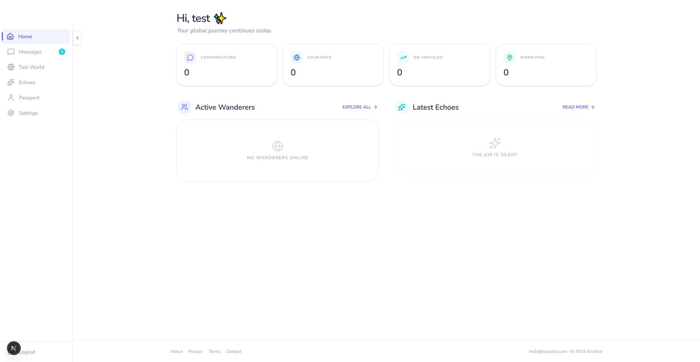
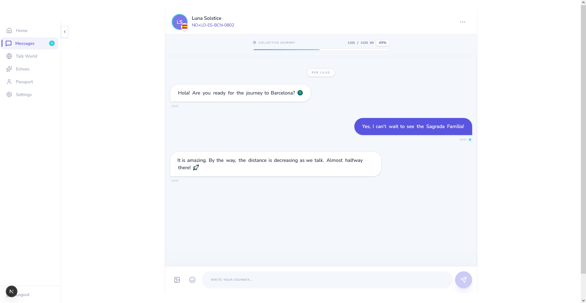
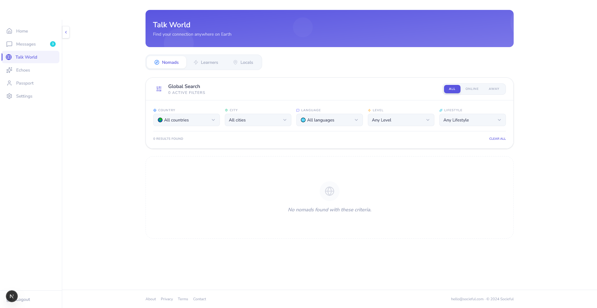
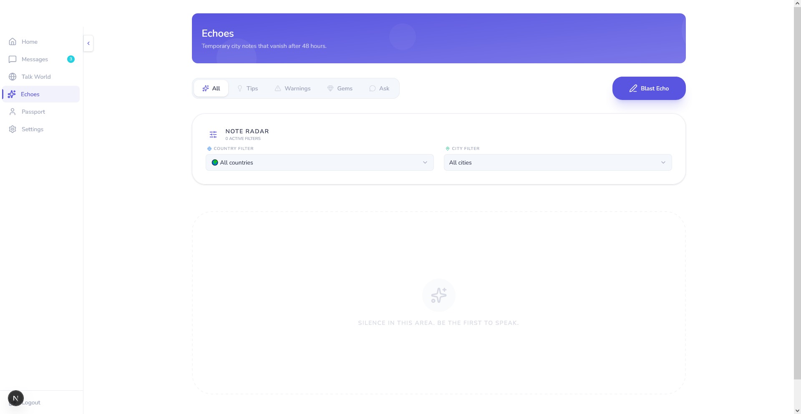
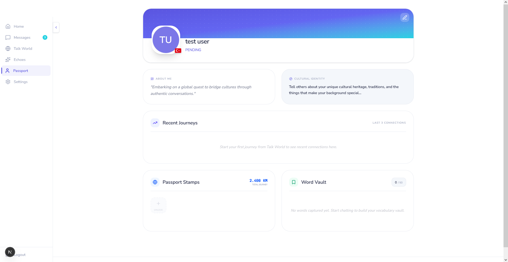

  

# 💛 Socieful

Real people. Real cities. Real connection.

---

Hey 👋  
I’m Hope Sky.

I’m a 32-year-old developer.

Socieful didn’t come out of nowhere. It’s something I’ve been thinking about for years — watching how the internet slowly changed, and how people became more “connected” on the surface, but actually more distant underneath.

At some point I started asking myself a simple question:  
**“Why is it so hard for people to genuinely find each other online?”**

---

## 🌍 Why Socieful?

Socieful exists for one simple reason:

> Real human connection should still be possible on the internet.

Not optimized.  
Not gamified.  
Not manipulated.

Just people finding people.

- without algorithmic control  
- without attention traps  
- without performance pressure  

---

## ✈️ Origin

Every time I traveled or met people from different places, I noticed something consistent:

Even when languages are different, people still want to talk.  
Even when cultures are different, people still want to connect.

But the internet today doesn’t really help with that — it filters everything.

That’s where Socieful began:

> A space where distance doesn’t block connection.

---

## 🧠 Echoes

Echoes is a core layer of Socieful.

A place for:
- short thoughts  
- local insights  
- warnings  
- hidden gems  
- questions  

But not content.

No likes. No virality. No ranking.

Just traces of human presence across time and place.

Sometimes a thought.  
Sometimes a feeling.  
Sometimes just: *“I was here.”*

---

## 🧪 Development Status

⚠️ Socieful is currently under active development.

What you see in this repository:
- UI structure is evolving  
- Design system is not final  
- Features may change or be redesigned  

This is a living system — not a finished product.

---

## 🖼️ Product Preview

---

### 💬 Chat

  

Private conversations between people across the world.

> ⚠️ This screen is a **development preview**. UI and features are not final.

---

### 🌍 Talk World

  

Real-time conversations between people across the world.

> ⚠️ This screen is a **development preview**. UI and features are not final.

---

### 🌍 Echoes

  

Local thoughts, tips, warnings, and human traces from cities.

> ⚠️ This screen is a **development preview**. UI and features are not final.

---

### 👤 Passport

  

Identity layer showing languages, journeys, and stamps.

> ⚠️ This screen is a **development preview**. UI and features are not final.

---

## 🛠️ Right now

Socieful is a solo project.

It’s being built slowly and intentionally — without rushing into scale before it feels right.

It’s not perfect.  
But it’s real.

---

## 💛 Support

If you believe in this idea:

* **GitHub Sponsors:** https://github.com/sponsors/socieful
* **Patreon:** https://www.patreon.com/socieful
* **Website:** https://socieful.com

Support helps keep the project alive and growing 🚀

---

Built with patience, curiosity, and hope. 💛

